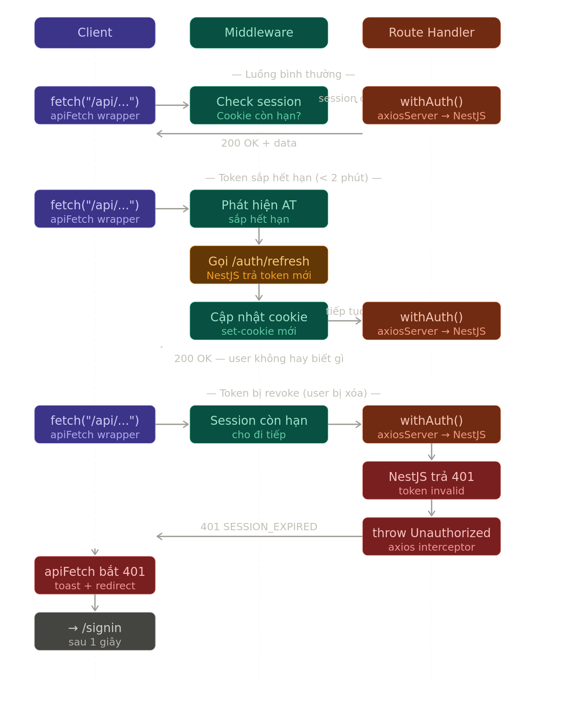

# 📊 BookStudio Dashboard

> _A modern AI-powered admin dashboard for managing an e-book platform — built with Next.js App Router, CopilotKit, and LangGraph_

## ✨ Introduction

**BookStudio Dashboard** is a full-featured admin interface for the [API-EBook](https://github.com/Hieuej147/ebook-api) backend. It is engineered with **Next.js 16 (App Router)** and **TypeScript**, featuring an intelligent AI Copilot powered by **CopilotKit + LangGraph** that can write book content, analyze business stats, manage todos, and interact directly with the dashboard UI.

### Why build this project?

- 🎯 **Modern Architecture**: Server Components, Route Handlers as proxy, httpOnly session cookies — no sensitive data leaks to the browser.
- 🤖 **AI-Native**: Deep CopilotKit + LangGraph integration — the AI can reorder dashboard cards, update stats, filter books, and write chapter content in real time.
- 🔐 **Security-First**: Arcjet runtime protection (rate limiting, bot detection, shield), Zod validation on all API routes, role-based access control.
- ⚡ **Performance**: Strategic use of `useMemo`, `useCallback`, `useRef` to minimize re-renders; debounced AI state sync on the chapter editor.
- 📱 **Responsive**: Full mobile/tablet support with collapsible sidebar and adaptive editor layout.

---

## 🛠️ Tech Stack

| Category          | Stack                                                       |
| ----------------- | ----------------------------------------------------------- |
| **Framework**     | Next.js 16 (App Router, Server Components, Server Actions)  |
| **Language**      | TypeScript                                                  |
| **UI**            | Tailwind CSS, shadcn/ui, Radix UI, Lucide Icons             |
| **State / Forms** | React Hook Form, Zod                                        |
| **Charts / DnD**  | Recharts, dnd-kit                                           |
| **Auth**          | `jose` (JWE), httpOnly session cookie, JWT refresh rotation |
| **API Layer**     | Axios (server-side proxy → NestJS), Next.js Route Handlers  |
| **AI / Copilot**  | CopilotKit v2, LangGraph (AG-UI protocol), OpenAI           |
| **Security**      | Arcjet (shield, rate limit, bot detection)                  |
| **Deploy**        | Vercel (Next.js), Render (Python Agent), Railway (NestJS)   |

---

## 🦄 Features

- **📊 AI Dashboard**: Drag-and-drop stat cards; AI can update stats, reorder cards, and render charts via `updateDashboardStats` tool.
- **📚 Book Management**: Full CRUD with paginated gallery, AI-powered search/filter (`filterBooks` tool), image upload to Cloudinary.
- **✍️ AI Book Editor**: Multi-chapter editor with Markdown preview, AI writes/edits content in real time, Human-in-the-Loop approval for AI edits.
- **📦 Order Management**: Paginated order list with status tracking (Pending → Shipped → Delivered).
- **👥 User Management**: User table with role display (NORMAL / PREMIUM / ADMIN), edit and delete actions.
- **🗂️ Category Management**: Category folders with book count and active rate progress bar.
- **✅ AI Todo List**: Add, edit, delete, toggle todos via AI chat (`manageTodo` tool).
- **🔐 Auth Flow**: Signin/Signup with JWT access token + refresh token rotation, automatic refresh in middleware before expiry.
- **🛡️ Runtime Security**: Arcjet shield + bot detection on all routes; stricter rate limiting on auth routes.
- **🌙 Dark Mode**: Full dark mode support via `next-themes`.

---

## 🤖 AI Agent Architecture

The AI Copilot is powered by a **Python LangGraph agent** running on Render, connected to the Next.js frontend via the **AG-UI protocol** (`ag_ui_langgraph`).

```
Browser (CopilotKit UI)
    ↓ POST /api/copilotkit
Next.js Route Handler
    ↓ LangGraphHttpAgent → AG-UI protocol
Python FastAPI (Render)
    ↓ LangGraph StateGraph
    ├── call_model_node (OpenAI)
    ├── write_chapter_node (AI Writer sub-agent)
    ├── edit_chapter_content_node (Human-in-the-Loop)
    ├── outline_node / edit_outline_node
    ├── stats_nodes (get_overview_stats, etc.)
    └── tavily_search / tavily_extract
```

---

## 🔐 Auth & Security Flow

```
User signin
  → NestJS returns { accessToken, refreshToken }
  → decodeJwtExpiry(accessToken) → atExpiresAt
  → Encrypt session (JWE) → httpOnly cookie

Every protected request
  → Middleware reads session cookie
  → If atExpiresAt - now < 2min → POST /auth/refresh (rotate tokens)
  → Update cookie with new tokens
  → Forward request

Role check
  → session.user.role !== "ADMIN" → redirect /unauthorized
  → /unauthorized → logoutAction → deleteSession → redirect /signin
```

---



---
## 🚀 Getting Started

### Prerequisites

- **Node.js** >= 18.x
- **pnpm** (recommended) or npm
- **NestJS backend** running → see [API-EBook](https://github.com/Hieuej147/ebook-api) for setup
- **Python AI Agent** running (optional) → also in API-EBook repo under `ai-agent-python/`

### Installation

**1. Clone repository**

```bash
git clone https://github.com/Hieuej147/ebook-dashboard.git
cd ebook-dashboard
```

**2. Install dependencies**

```bash
pnpm install
```

**3. Setup environment variables**

Create `.env.local` in the root:

```env
# NestJS Backend URL
NESTJS_API_URL=your-nest-api

# Session encryption key (min 32 chars)
# Generate with: openssl rand -hex 32
SESSION_SECRET_KEY=your-super-strong-random-secret-min-32-chars

# CORS allowed origin
ALLOWED_ORIGIN=your-frontend

# Python AI Agent URL (Render)
DEPLOYMENT_URL=your-agent

# Arcjet runtime security key
ARCJET_KEY=ajkey_xxx
```

**4. Start dev server**

```bash
pnpm dev
```

App runs at: **http://localhost:3001** if you run nestjs :3000

---

## 📖 Available Scripts

```bash
pnpm dev        # Start dev server (Turbopack)
pnpm build      # Build for production
pnpm start      # Start production build
pnpm lint       # Run ESLint
```

---


## 🔄 What I Learned

- **Next.js App Router patterns**: Server Components for data fetching, Route Handlers as secure proxies, Server Actions for mutations.
- **CopilotKit + LangGraph integration**: AG-UI protocol, `useCoAgent` shared state, `useFrontendTool`, `useHumanInTheLoop`, `useLangGraphInterrupt`.
- **Auth architecture**: httpOnly JWE session cookies, silent token refresh in middleware, role-based redirects without client-side exposure.
- **Performance optimization**: `useMemo`/`useCallback` to prevent unnecessary re-renders, `useRef` for non-visual state (typing buffer, agent flags), debounced AI state sync.
- **Security hardening**: Arcjet integration, Zod validation on all mutation routes, `isRedirectError` handling in error boundaries.


---

## 🎬 Demo


[Watch full demo](./assets/output-small.mp4)
---
## 📝 License

This project is **UNLICENSED** — for educational and portfolio purposes.

---

## 👨‍💻 Author

**Hieu Dev**

- GitHub: [@Hieuej147](https://github.com/Hieuej147)
- Backend Repo: [API-EBook](https://github.com/Hieuej147/ebook-api)

---

<div align="center">
  <sub>Built with ❤️ using Next.js, CopilotKit, and LangGraph</sub>
</div>
